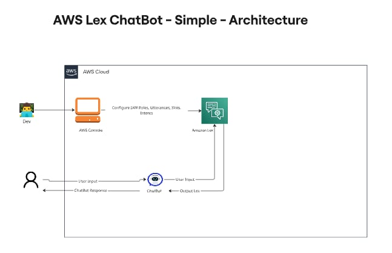

ChatBot with Amazon Lex 🤖

- Location: Ireland
So Amazon Lex can work!

- Create an Empty Chatbot
Begin by creating a new bot in Amazon Lex with a basic configuration.
-IAM Roles
-Idle session timeout

- Specify Intents and Slots

- Define user intents, like TranslateIntent, to manage translation requests.
Add slots to capture details, such as the target language.
Specify Fulfillment
Set up fulfillment to manage how Lex responds, using AWS Lambda to handle the request and Amazon Translate for translation.

- Build and Test the Chatbot
Integrate and test the bot in the Amazon Lex console, checking for correct interaction.

AWS Services Used 🛠
- Amazon Lex: To build and manage the chatbot and define the conversation flow.

Conclusion
- This chatbot project demonstrates the powerful integration capabilities of Amazon. It’s an exciting way to learn about serverless applications and real time interaction with AWS. Happy building!

Architecture

